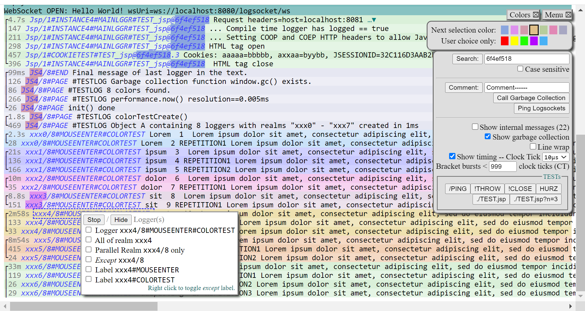

# LogSocket
~ My cross-platform diagnostics logging tool ~

Demonstrable version coming soon... Meanwhile you might at least have a glimpse at my coding skills.

The whole Thing (if it is one) started as a wild programming exercise in late September 2023. I wanted to get fluent again after some years of hiatus and try out the full stack, from color space, CSS, HTML to JavaScript and Java, some functional vs. classical OO programming, JavaScript promises vs. Java futures, garbage collection, etc. - except SQL...

The exercise consists of a hybrid of the chat server pattern and the logger pattern, plus, a helpful web browser based user interface for big monospaced plain text in technicolor. All in bare bones Java/JavaScript (not even jQuery) for good reason. The logger can be implemented in any language that supports WebSockets (and ideally weak references). Here is an outdated screenshot with colors picked by eyeballing:



The performance of JavaScript/DOM in Chrome is quite amazing: It takes a second or two to fold 10000 long lines of double Lorem Ipsum, or to color 30000 search results. However, the memory consumption then approaches 1GB, which is less impressive. For me, a second is too long (I'm used to late 20th century Linux desktop performance), so I added some optimization: The new CSS `content-visibility` property spoils my design (note line overshoot in screenshot) and Chrome's `contentvisibilityautostatechange` event is buggy - but [IntersectionObserver](https://developer.mozilla.org/en-US/docs/Web/API/Intersection_Observer_API) speeds up rendering performance just as well, if not better, when combined with my tiny async functional framework. Javascript Web APIs like this is why I enjoy JavaScript so much more than 10 years ago. Down with extra libs and frameworks!

## Why yet another logger?
...

## Erlang!
A nice experimental result is the [Erlang distribution](https://en.wikipedia.org/wiki/Erlang_distribution) in situ, which was first found for early telephone systems and also looks valid in my 3-websocket system: This sample uses a plain java.net.http.WebSocket logger, a Tomcat javax.websocket server, and a JavaScript websocket client in a Chrome browser window in an elderly laptop. (A javax.websocket logger at a 2nd Tomcat is half as fast, with a similar looking distribution. TODO: Try TooTallNate's org.java_websocket, perhaps minimize for logger.)
```
N=3500 Min=62.9 Max=8267.7 Median=116 Mean=173.4
--------------------------------------------------
|#=   (61) 62.9 ~ 76.8μs
|########   (283) 78.5 ~ 90.7μs
|#########################   (870) 90.8 ~ 104.7μs
%#################-   (604) 104.8 ~ 118.6μs
|##############=   (516) 118.7 ~ 132.5μs
|#############-   (462) 132.6 ~ 146.5μs
|#####   (176) 146.6 ~ 160.3μs
+##=   (93) 160.7 ~ 174.1μs
|#=   (61) 174.6 ~ 188.2μs
|#-   (51) 188.5 ~ 201.8μs
|#   (36) 203.1 ~ 215.7μs
|#   (35) 216.4 ~ 228.5μs
|=   (22) 230.2 ~ 243.7μs
|-   (17) 245 ~ 257.7μs
|-   (7) 258.5 ~ 267.3μs
|-   (12) 272.4 ~ 285.1μs
|-   (13) 285.9 ~ 298.6μs
|-   (7) 300.3 ~ 313.2μs
|-   (9) 314.5 ~ 326.9μs
|-   (9) 327.7 ~ 340.7μs
|   (3) 343.9 ~ 353.7μs
|   (5) 357.8 ~ 368.8μs
|-   (9) 375.7 ~ 382.8μs
|-   (7) 385.4 ~ 394.5μs
|   (3) 399.7 ~ 402μs
⋮
|   (129) 431.6 ~ 5736.7, 5904.2, 8267.7μs
--------------------------------------------------
Skew:4,7 "%"=Median "+"=Mean 
```
